# Satellite Image Processing

Welcome to the Satellite Image Processing project! This repository contains a collection of tools and scripts designed to process satellite images. Whether you are working with color or grayscale images, this project aims to provide a comprehensive set of functionalities for your image processing needs.

## Folder Structure

The project folder is organized as follows:

- **Color_Processed_Images/**: Contains Processed color images.
- **Gray_images/**: Contains original grayscale images.
- **alpha_blending.py**
- **color_equalization.py**
- **color_histogram.py**
- **equalization_clahe.py**
- **gray_histogram.py**
- **gray_normalize_histogram.py**
- **increase_saturation.py**
- **set_gray_histogram_range.py**
- **set_rgb_histogram_range.py**
- **unsharp_mask.py**
- The processed image of each file is stored in the out_ folder.

## File Summaries

### 1. alpha_blending.py

This script uses OpenCV for real-time alpha blending of two images.
Interactively adjust blending with a trackbar, and save the result with a keypress.
Perfect for exploring different image blends.

### 2. color_equalization.py

This script applies histogram equalization to a collection of color images in a specified input directory.
It converts images to YUV color space, equalizes the Y channel, and saves the results in an output directory.
Visualization of original and equalized images is displayed for comparison.

### 3. color_histogram.py

This script reads color images from a specified folder, displays each image alongside its RGB histogram, and visualizes the distribution of pixel values for each color channel.
It provides insights into the color composition of the images in the folder.

### 4. equalization_clahe.py

This script applies Contrast Limited Adaptive Histogram Equalization (CLAHE) to a collection of images in a specified input directory.
It enhances the brightness channel using CLAHE in the YUV color space and saves the results in an output directory.
The script provides visualizations of the original and enhanced images for comparison.

### 5. gray_histogram.py

This script reads grayscale images from a specified folder, displays each image alongside its pixel value histogram, and visualizes the distribution of pixel values.
It provides insights into the intensity distribution of the images in the folder.

### 6. gray_normalize_histograme.py

This script reads grayscale images from a specified folder, normalizes each image, and displays both the original and normalized images alongside their respective histograms.
The normalization ensures pixel values fall within the 0 to 255 range, providing a clearer understanding of intensity distribution.

### 7. increase_saturation.py

This script reads images from a specified input folder, increases their saturation, and saves the processed images to an output folder. 
The degree of saturation increase is controlled by the `saturation_factor` parameter.

### 8. set_gray_histogram_range.py

This script loads a grayscale image, adjusts its pixel values within a specified range, and visualizes the original and adjusted images along with their respective histograms.
The adjusted image is saved with a filename indicating the applied threshold values.
Adjust the `low_threshold` and `high_threshold` values as needed for your specific image.

### 9. set_rgb_histogram_range.py

This script loads an RGB image, adjusts pixel values within specified ranges for each RGB channel, and visualizes the original and adjusted images along with their respective histograms.
The adjusted image is saved with a filename indicating the applied threshold values.
Adjust the `low_thresholds` and `high_thresholds` lists as needed for your specific image.

### 10. unsharp_mask.py

This script reads images from a specified input folder, applies unsharp masking to enhance image details, and saves the sharpened images to an output folder.
The sharpening effect is achieved through a combination of Gaussian blurring and weighted addition. Adjustments to the sharpening parameters can be made as needed.

## Usage

Each Python file is designed to be run from the command line. Here is an example for `alpha_blending.py`:

```bash
python alpha_blending.py
```

## Example

### Original Gray Image
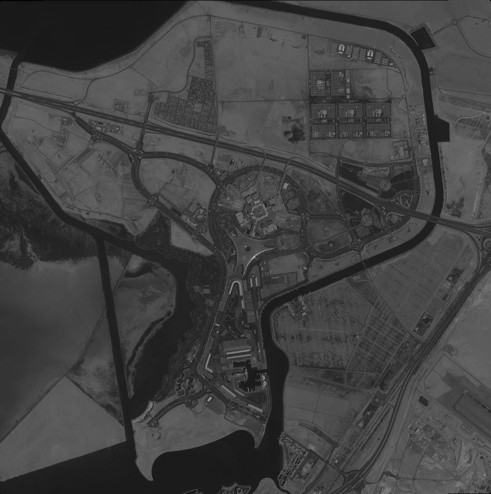

### Original Color Image
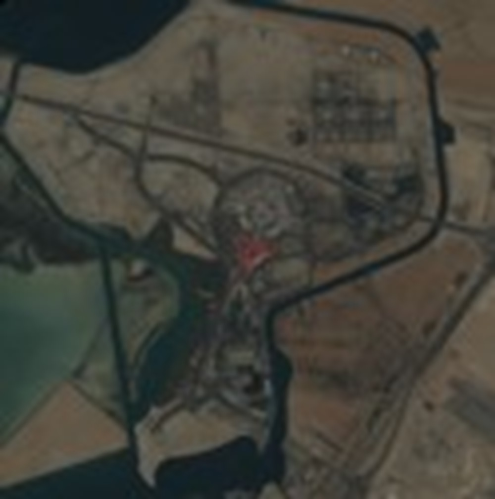

### Alpha Blending
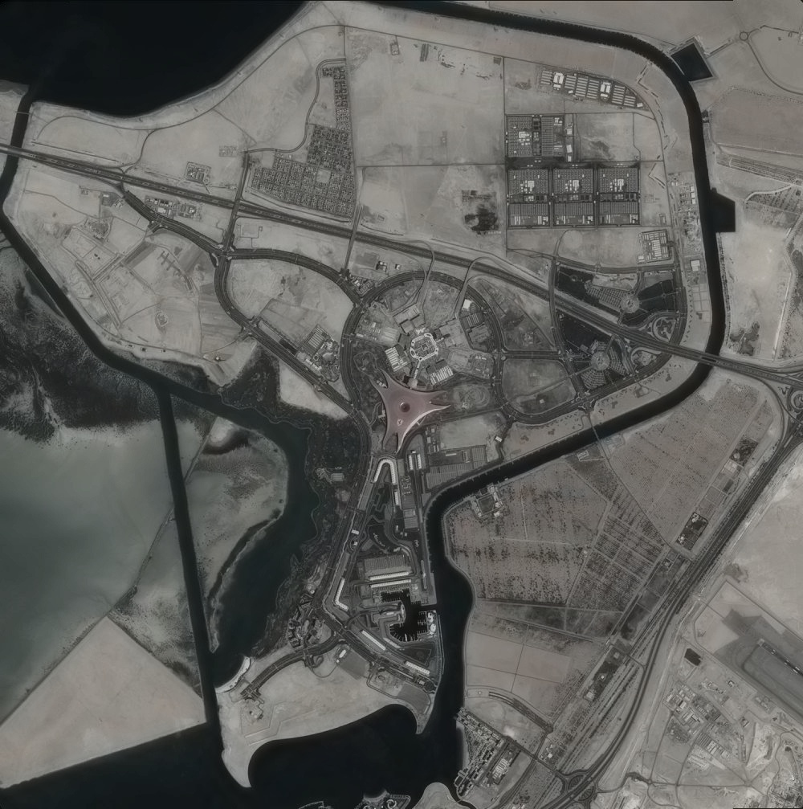

### Color Equalization
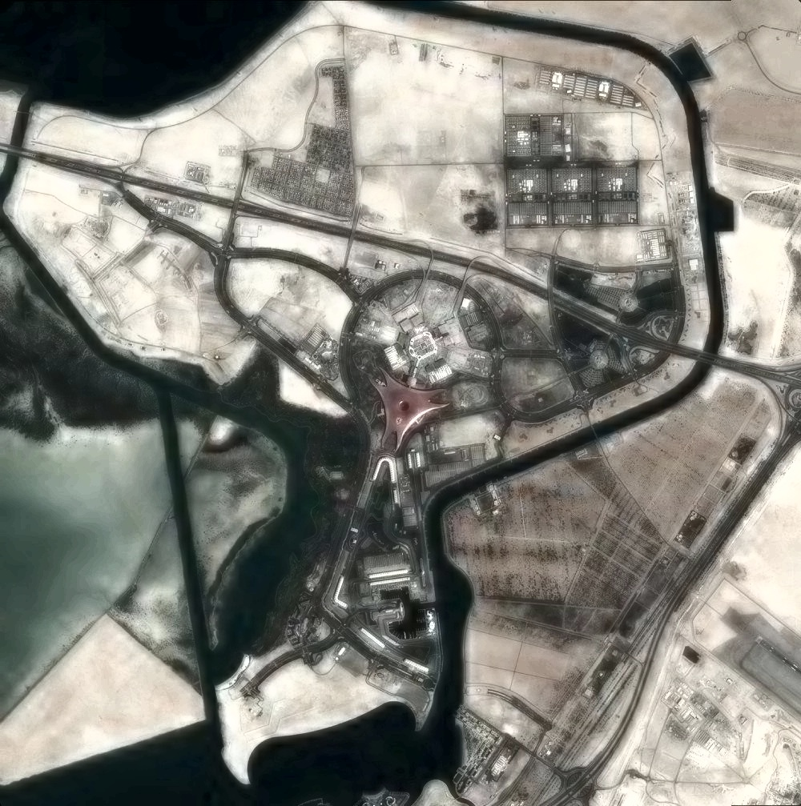

### Equalization CLAHE
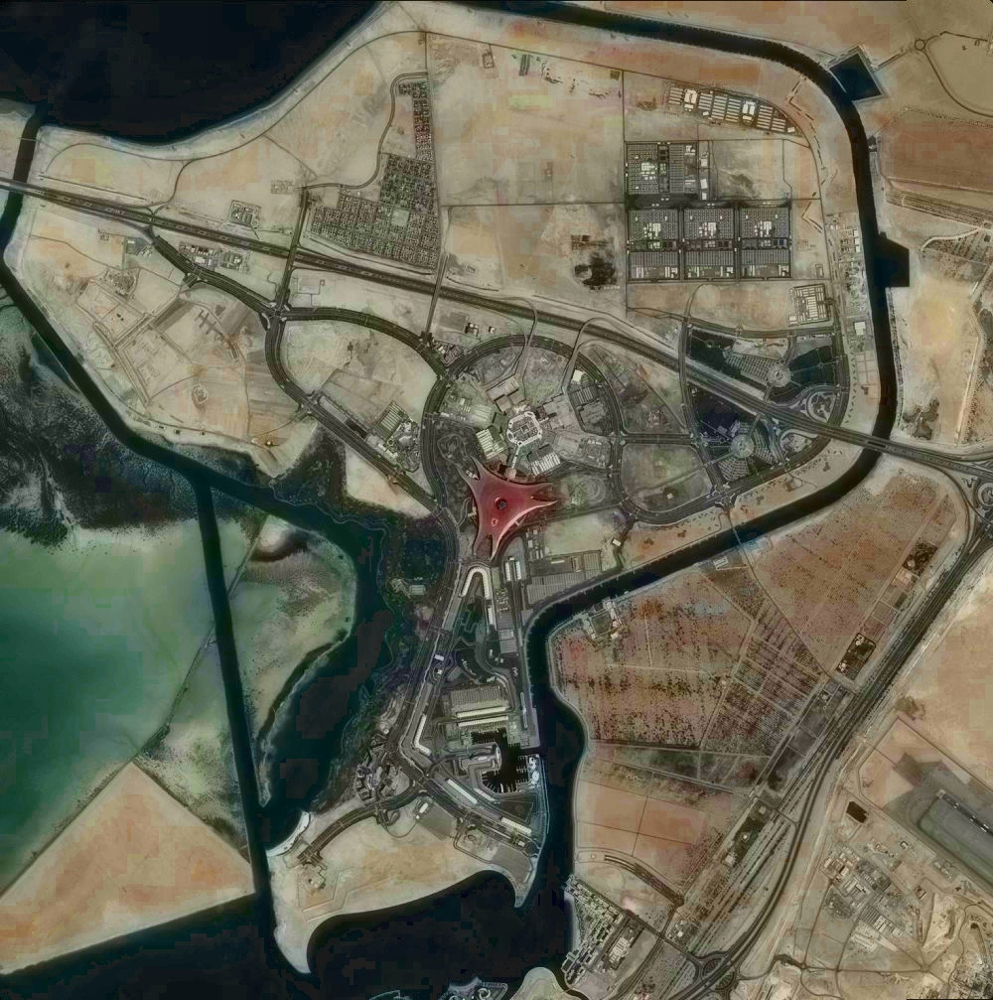

### Increase Saturation
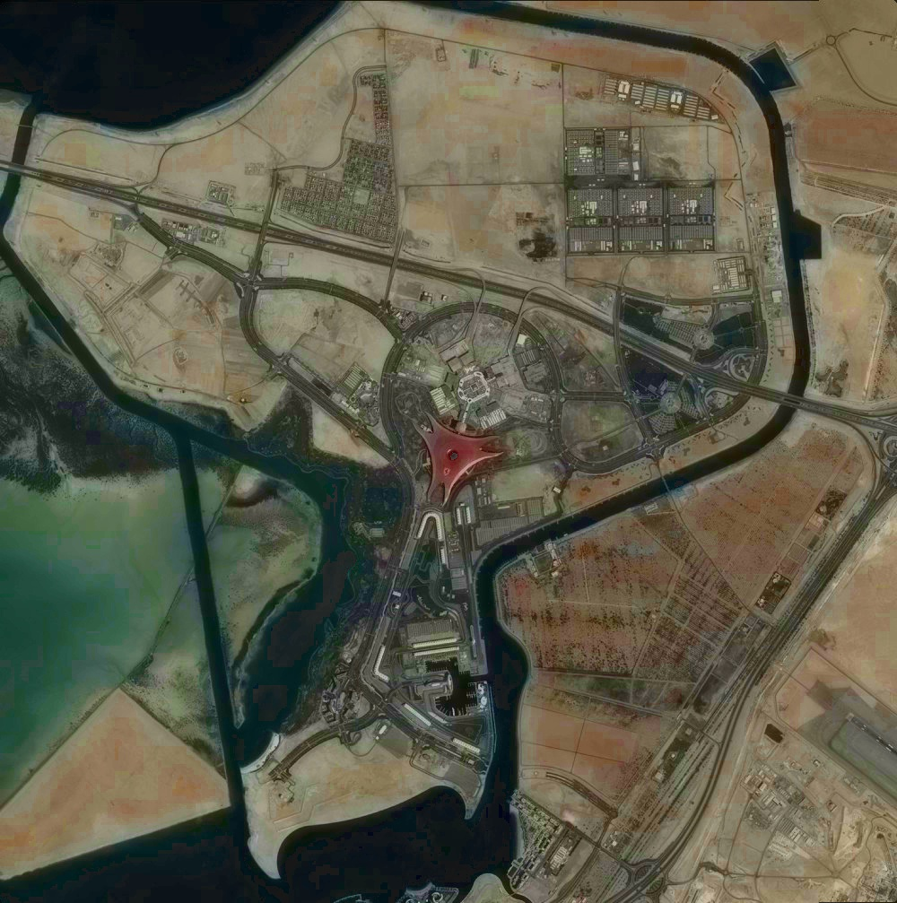

### Unsharp Mask
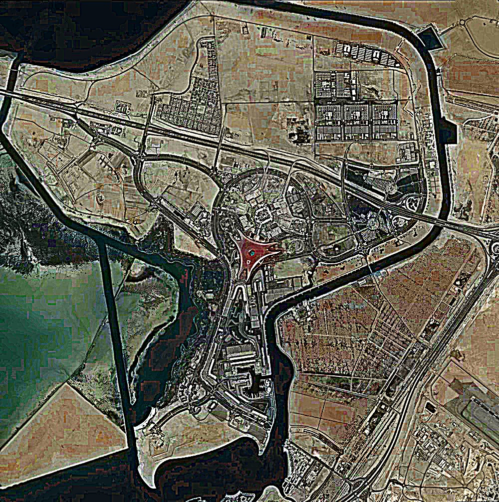

### Gray Histogram
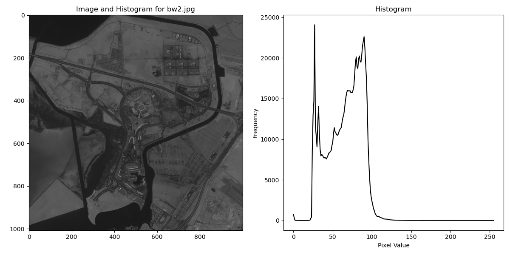

### Gray Normalize Histogram
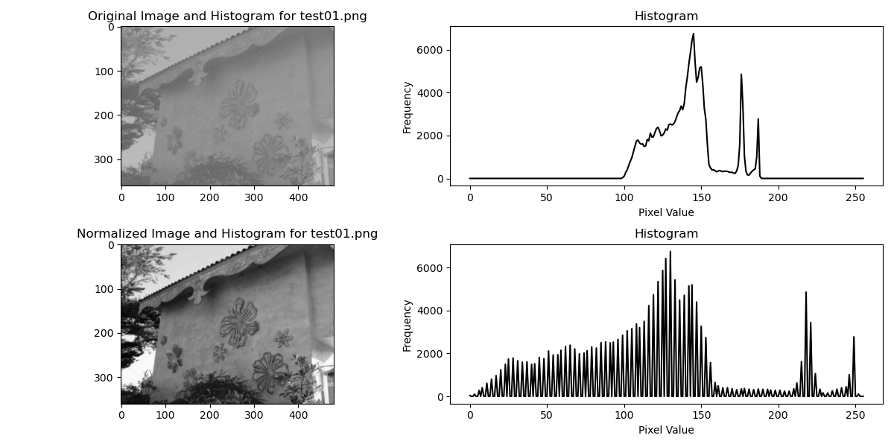

### Set Gray Histogram Range
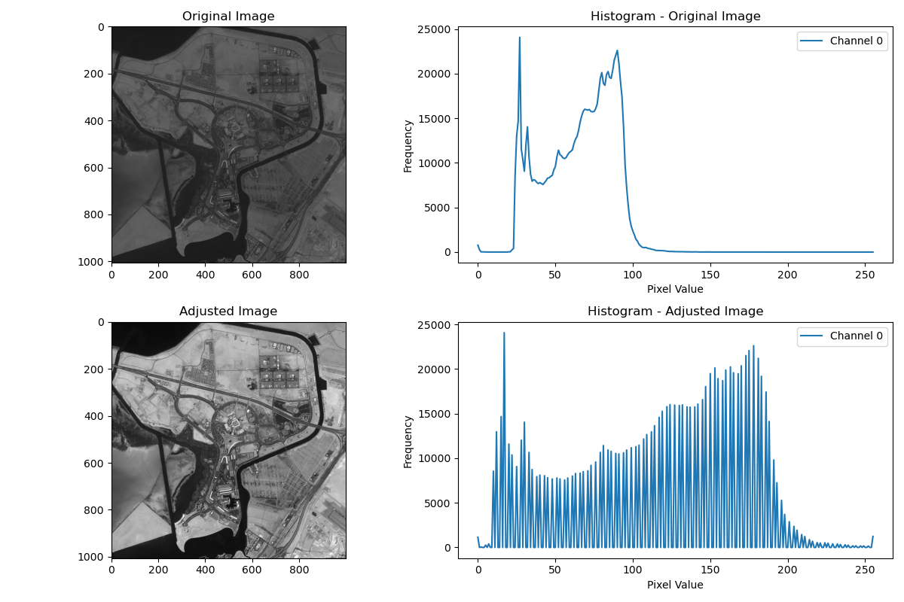

### Color Histogram
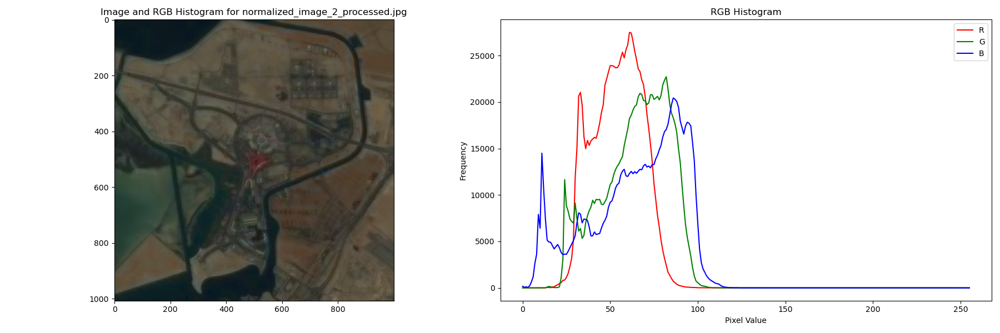

### Set RGB Histogram Range
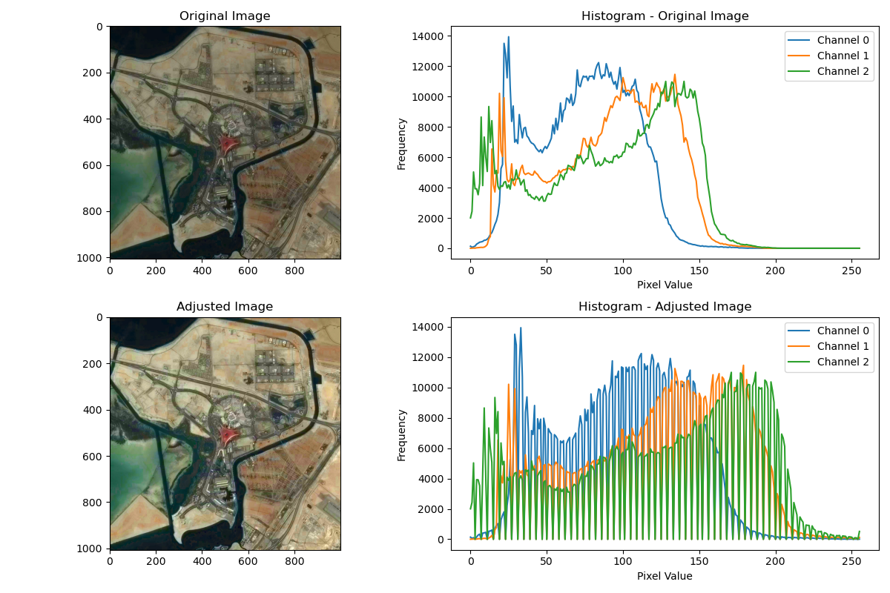

## Summary


## License
All code and documentation in this project are available under the [MIT License](https://opensource.org/licenses/MIT).
See the [LICENSE file](./LICENSE) for details.


